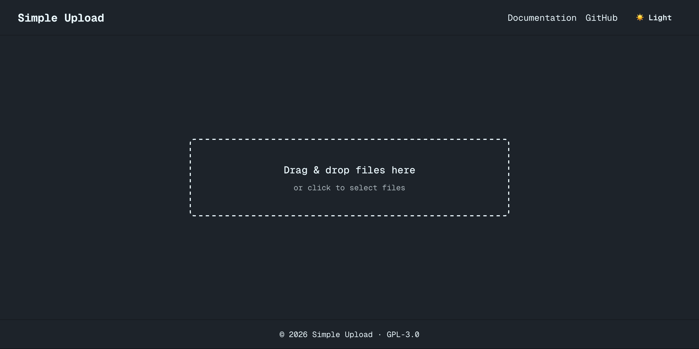

# 🚀 SUS3 — Simple Upload for AWS Simple Storage Service (S3) 🪣

**SUS3** is a tiny, copy-paste–friendly upload utility for **Amazon S3** ☁️

- 🧩 No abstractions
- ✨ No magic
- 🚫 No SDK on the client
- 🔐 Works with **presigned PUT, POST, and Multipart**
- ⚛️ Framework-native hooks (**React**, **Solid**)
- 🖥️ Server helpers for **TypeScript backends**

> 🧠 SUS3 is “just enough glue” between your frontend and S3.

## 📚 Table of Contents

- [🚀 SUS3 — Simple Upload for AWS Simple Storage Service (S3) 🪣](#-sus3--simple-upload-for-aws-simple-storage-service-s3-)
  - [📚 Table of Contents](#-table-of-contents)
  - [🎬 Demo](#-demo)
  - [✨ Features](#-features)
  - [📦 Installation](#-installation)
  - [✂️ Code Usage (Copy \& Paste Friendly)](#️-code-usage-copy--paste-friendly)
  - [⚛️ React Usage](#️-react-usage)
    - [📤 Client-side upload (PUT)](#-client-side-upload-put)
  - [🧱 SolidJS Usage](#-solidjs-usage)
    - [📤 Client-side upload](#-client-side-upload)
  - [🖥️ TypeScript Server Usage](#️-typescript-server-usage)
    - [⚙️ Setup](#️-setup)
  - [🧠 Design Principles](#-design-principles)
  - [🧪 Testing](#-testing)
  - [🧩 When NOT to use SUS3](#-when-not-to-use-sus3)
  - [📄 License](#-license)

---

## 🎬 Demo



A minimal demo app showing:

- Drag & drop file upload  
- Presigned PUT uploads to S3  
- Real-time progress tracking  
- React + Solid parity  
- Zero client-side AWS SDK usage  

📖 [Demo Walkthrough](https://hieudoanm-simple-upload.vercel.app/)

---

## ✨ Features

- ✅🔗 Presigned **PUT** uploads
- ✅📮 Presigned **POST** uploads (strict policy)
- ✅🧱 **Multipart** uploads for large files
- ⚛️ React hook
- 🧱 SolidJS hook
- 🛡️ Type-safe backend helpers
- 🌐 Fetch-based (no XHR unless you want it)
- 📄 All code fits in **one file per package**

---

## 📦 Installation

```bash
pnpm add @simple-upload/react @simple-upload/solid
pnpm add @simple-upload/server
```

or

```bash
yarn add @simple-upload/react @simple-upload/solid
yarn add @simple-upload/server
```

or

```bash
npm install @simple-upload/react @simple-upload/solid
npm install @simple-upload/server
```

---

## ✂️ Code Usage (Copy & Paste Friendly)

Each package intentionally exposes **everything from a single file** 📄

You can:

- 📥 Import it normally
- ✂️ Or copy the file into your project and modify freely

🚫 No hidden dependencies.

---

## ⚛️ React Usage

### 📤 Client-side upload (PUT)

```tsx
import { useSimpleUpload } from '@simple-upload/react';

export const UploadButton = () => {
  const { uploadPutFile, uploading, progress } = useSimpleUpload();

  const onChange = async (e: React.ChangeEvent<HTMLInputElement>) => {
    const file = e.target.files?.[0];
    if (!file) return;

    const res = await fetch('/api/presign-put');
    const { url } = await res.json();

    await uploadPutFile(file, url);
  };

  return (
    <>
      <input type="file" onChange={onChange} />
      {uploading && <p>Uploading… {progress}%</p>}
    </>
  );
};
```

---

## 🧱 SolidJS Usage

### 📤 Client-side upload

```tsx
import { useSimpleUpload } from '@simple-upload/solid';

const Upload = () => {
  const { uploadPutFile, uploading, progress } = useSimpleUpload();

  const onFile = async (e: Event) => {
    const file = (e.target as HTMLInputElement).files?.[0];
    if (!file) return;

    const res = await fetch('/api/presign-put');
    const { url } = await res.json();

    await uploadPutFile(file, url);
  };

  return (
    <>
      <input type="file" onChange={onFile} />
      <Show when={uploading()}>
        <p>Uploading… {progress()}%</p>
      </Show>
    </>
  );
};
```

---

## 🖥️ TypeScript Server Usage

Works in:

- ⏭️ **Next.js API routes**
- 🧬 **GraphQL resolvers**
- 🔌 **tRPC procedures**
- 🟢 Any Node.js backend

### ⚙️ Setup

```ts
import {
  S3Client,
  CreateMultipartUploadCommand,
  UploadPartCommand,
  CompleteMultipartUploadCommand,
  PutObjectCommand,
} from '@aws-sdk/client-s3';
import { getSignedUrl } from '@aws-sdk/s3-request-presigner';
import { createPresignedPost } from '@aws-sdk/s3-presigned-post';

/* ---------------------------------- */
/* Config                             */
/* ---------------------------------- */

export interface SimpleUploadConfig {
  bucket: string;

  /** AWS region OR "auto" for Supabase */
  region: string;

  /** Required for Supabase */
  endpoint: string;

  /** Required for Supabase */
  credentials: {
    accessKeyId: string;
    secretAccessKey: string;
  };

  maxFileSize?: number;
  allowedTypes?: string[];
  expiresInSeconds?: number;
}

export const createSimpleUpload = (config: SimpleUploadConfig) => {
  const s3 = new S3Client({
    region: config.region,
    endpoint: config.endpoint,
    credentials: config.credentials,
    forcePathStyle: !!config.endpoint, // 👈 REQUIRED for Supabase
  });

  const validate = (file: { size?: number; type?: string }) => {
    if (config.maxFileSize && file.size && file.size > config.maxFileSize) {
      throw new Error('File too large');
    }

    if (
      config.allowedTypes &&
      file.type &&
      !config.allowedTypes.includes(file.type)
    ) {
      throw new Error('Invalid file type');
    }
  };

  /* ---------- PUT ---------- */
  const presignPut = async (input: {
    key: string;
    type: string;
    size?: number;
  }): Promise<string> => {
    validate(input);

    const cmd = new PutObjectCommand({
      Bucket: config.bucket,
      Key: input.key,
      ContentType: input.type,
    });

    return getSignedUrl(s3, cmd, {
      expiresIn: config.expiresInSeconds ?? 60,
    });
  };

  /* ---------- POST ---------- */
  const presignPost = async (input: {
    key: string;
    type: string;
    size: number;
  }) => {
    validate(input);

    return createPresignedPost(s3, {
      Bucket: config.bucket,
      Key: input.key,
      Expires: config.expiresInSeconds ?? 60,
      Conditions: [
        ['content-length-range', 0, config.maxFileSize ?? input.size],
        ['starts-with', '$Content-Type', input.type],
      ],
      Fields: {
        'Content-Type': input.type,
      },
    });
  };

  /* ---------- Multipart ---------- */
  const createMultipart = async (input: {
    key: string;
    type: string;
  }): Promise<string> => {
    const res = await s3.send(
      new CreateMultipartUploadCommand({
        Bucket: config.bucket,
        Key: input.key,
        ContentType: input.type,
      })
    );

    if (!res.UploadId) {
      throw new Error('Failed to create multipart upload');
    }

    return res.UploadId;
  };

  const presignPart = async (input: {
    key: string;
    uploadId: string;
    partNumber: number;
  }): Promise<string> => {
    const cmd = new UploadPartCommand({
      Bucket: config.bucket,
      Key: input.key,
      UploadId: input.uploadId,
      PartNumber: input.partNumber,
    });

    return getSignedUrl(s3, cmd, { expiresIn: 3600 });
  };

  const completeMultipart = async (input: {
    key: string;
    uploadId: string;
    parts: { ETag: string; PartNumber: number }[];
  }): Promise<void> => {
    await s3.send(
      new CompleteMultipartUploadCommand({
        Bucket: config.bucket,
        Key: input.key,
        UploadId: input.uploadId,
        MultipartUpload: { Parts: input.parts },
      })
    );
  };

  return {
    presignPut,
    presignPost,
    createMultipart,
    presignPart,
    completeMultipart,
  };
};
```

---

## 🧠 Design Principles

- 🧭 You own the flow
- 🔓 No runtime coupling
- 🧹 No global config
- 📄 One file = one mental model
- 🐞 Easy to debug
- 🗑️ Easy to delete

If you understand S3 presigned URLs, you already understand SUS3 🎯

---

## 🧪 Testing

- 🧪 React & Solid hooks are unit-testable
- 🧰 Uses **jest + jsdom**
- 🌐 Fetch is fully mockable
- ☁️ No AWS calls in client tests

---

## 🧩 When NOT to use SUS3

- 🔁 You want resumable uploads across sessions
- ♻️ You need automatic retries or concurrency control
- 🎨 You want a UI component library

SUS3 is intentionally **low-level** ⚙️

---

## 📄 License

🧾 **GPL-3.0** — this project is licensed under the GNU General Public License v3.0.
